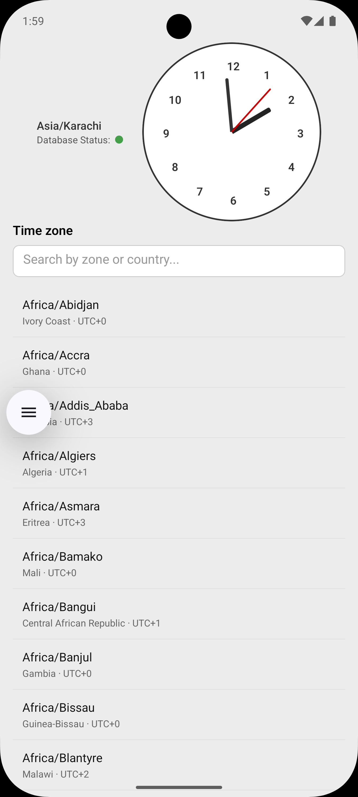
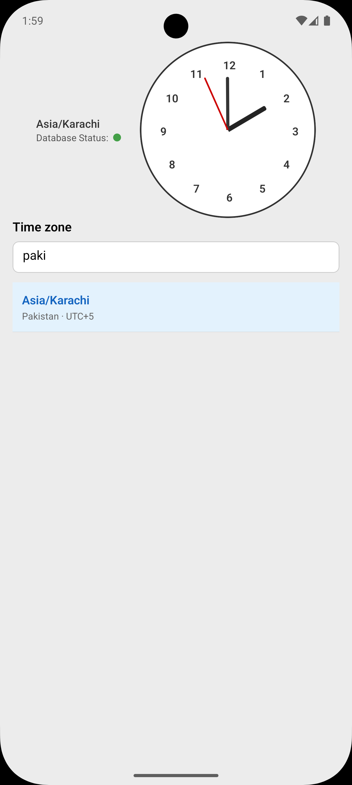

# Analog Clock App

A **React Native** app that shows a live analog clock for any time zone. Pick a time zone from a searchable list; the app works **offline-first** by caching time zone data and your last selection in SQLite.

## Screenshots & Video




### Demo video

[Watch demo](https://www.youtube.com/shorts/kjg49oHbN9k)

---

## About the Project

This is a [React Native](https://reactnative.dev) project. The clock is built with custom components (no third-party clock widgets). Time zone data comes from the [TimeZoneDB API](https://timezonedb.com/api) and is stored locally so the app works without internet after the first load.

## Features & Functionality

- **Analog clock** – Hour, minute, and second hands; updates every second and resizes with device/orientation.
- **Time zone selector** – List of time zones (from TimeZoneDB). Tap one to show that zone’s time on the clock.
- **Search** – Filter the list by zone name or country name (e.g. “New York”, “London”, “India”).
- **Offline-first** – Time zone list is cached in SQLite. On launch the app reads from the database first; the API is used only when the cache is empty or missing. After one successful fetch, the app works offline.
- **Persisted selection** – Last selected time zone is saved in the database and restored on next launch. If nothing is saved, the device’s current time zone is used.
- **DB status indicator** – Shows whether data is from the device cache (“stored”), cache is empty, or the database is unavailable.
- **Refetch** – If the API fails, an error message is shown with a “Refetch” button to try again.

## How to Run

### Prerequisites

- **Node.js** ≥ 18
- [React Native environment](https://reactnative.dev/docs/set-up-your-environment) set up (Android Studio / Xcode, emulator or device, etc.)
- **Yarn** or **npm**

### Install dependencies

From the project root:

```sh
yarn install
# or: npm install
```

### Start Metro

In one terminal, start the Metro bundler:

```sh
yarn start
# or: npm start
```

### Run on device / emulator

With Metro running, open a **second** terminal and run:

**Android**

```sh
yarn android
# or: npm run android
```

**iOS** (macOS only)

Install CocoaPods dependencies first (on first clone or after changing native deps):

```sh
bundle install
bundle exec pod install
```

Then run:

```sh
yarn ios
# or: npm run ios
```

The app will open in the Android Emulator, iOS Simulator, or a connected device. You can also build and run from **Android Studio** or **Xcode** if you prefer.

### Reload the app

- **Android**: Double-tap <kbd>R</kbd> or open the dev menu (<kbd>Ctrl</kbd>+<kbd>M</kbd> / <kbd>Cmd</kbd>+<kbd>M</kbd>) → **Reload**.
- **iOS**: Press <kbd>R</kbd> in the simulator.

---

## Troubleshooting

If you run into setup or run issues, see the official [Troubleshooting](https://reactnative.dev/docs/troubleshooting) guide.

## Learn More

- [React Native – Get started](https://reactnative.dev/docs/getting-started)
- [React Native – Environment setup](https://reactnative.dev/docs/environment-setup)
- [React Native GitHub](https://github.com/facebook/react-native)
